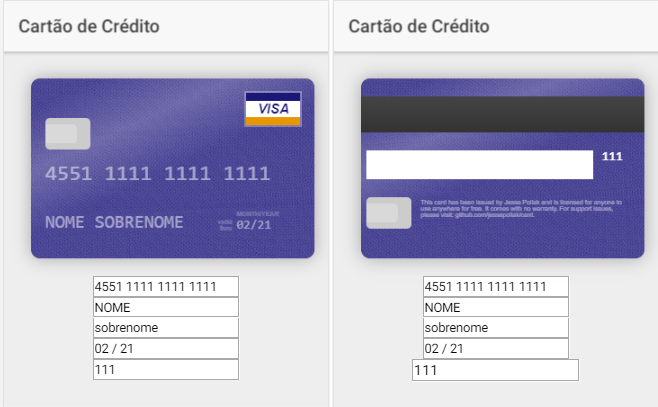

# cardjs-example
An example of usage library Card.js on Ionic app

## Telas / Screens: 

# To run:
* > npm install

* > ionic serve (run in browser)

or

* > ionic cordova run android 

or

* > ionic cordova run ios 
